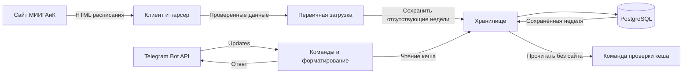
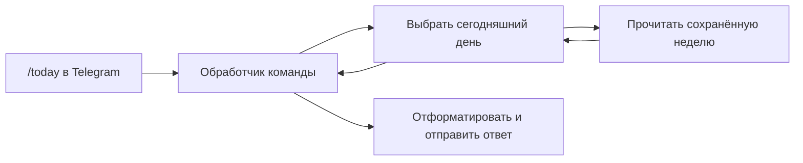

# Как устроена Lunara

Этот документ объясняет проект с нуля: какую задачу решает каждый компонент,
как они связаны и что происходит при запуске. Он описывает состояние после
**этапа 5**. Инструкции и полный список настроек находятся в [README](README.md).

## 1. Что уже умеет приложение

Сейчас Lunara получает недельное расписание с сайта МИИГАиК, превращает его в
удобные данные, сохраняет в PostgreSQL и отвечает на Telegram-команды из кеша.
Поддерживаются личные чаты и один настроенный групповой чат.

Сравнение, двухшаговое подтверждение, карантин и история уже реализованы.
Периодический запуск проверок, автоматические уведомления и экзамены ещё предстоит
подключить. Сейчас перезапуск не обновляет уже сохранённые недели.

## 2. Общая картина

Есть три внешних участника: сайт с расписанием, PostgreSQL и Telegram Bot API.
Между ними работает одна Go-программа.



Это схема движения данных. Каждый прямоугольник внутри приложения — пакет с
определённой задачей. Они работают в одном процессе; отдельных серверов для
парсера, загрузчика или хранилища нет.

## 3. Для чего нужны папки

| Путь | Что находится внутри | Зачем это выделено отдельно |
|---|---|---|
| `cmd/bot` | Основная программа | Соединяет компоненты, запускает загрузку и обрабатывает завершение |
| `cmd/schedule` | Команда разовой проверки | Позволяет увидеть расписание с сайта или из БД в JSON |
| `cmd/migrate` | Команда подготовки БД | Создаёт и обновляет таблицы |
| `internal/config` | Чтение настроек | Группа, подключение, тайм-ауты и календарь настраиваются без изменения кода |
| `internal/schedule` | Модели и календарь | Все компоненты одинаково понимают занятие, неделю и дату |
| `internal/source/miigaik` | HTTP-клиент и HTML-парсер | Здесь сосредоточена зависимость от устройства сайта |
| `internal/storage` | Запросы к PostgreSQL | Здесь находится логика чтения и сохранения расписания |
| `internal/scheduler` | Первичная загрузка | Решает, какие недели нужно получить, и координирует сохранение |
| `internal/telegram` | Bot API и команды | Получает updates, выбирает данные из кеша и форматирует ответы |
| `internal/changes` | Сравнение расписаний | Сопоставляет занятия и описывает добавления, удаления и изменения полей |
| `migrations` | Версионированные SQL-файлы | Описывают структуру таблиц и изменения этой структуры |
| `scripts` | Вспомогательные команды | Сейчас здесь скрипт интеграционных тестов |
| `.local` | Локальные артефакты проверок | Временные БД, собранные программы и вспомогательные файлы |

`cmd` — точки входа: то, что запускается как отдельная команда.
`internal` — внутренние пакеты приложения: команды используют их код.
Слово «пакет» здесь означает группу Go-файлов с общей ответственностью.

Например, изменение HTML сайта обычно требует правок в `source/miigaik`.
Правила работы с БД при этом остаются в `storage`, а календарь — в `schedule`.

## 4. Как сайт превращается в расписание

### Клиент получает страницу

HTTP-клиент отправляет обычный GET-запрос. Для него нужны ID группы и диапазон
дат с понедельника по воскресенье:

```text
https://study.miigaik.ru/?groupId=1306&dateStart=2026-09-28&dateEnd=2026-10-04
```

Ответ — HTML, то есть разметка страницы. Браузер для получения занятий не нужен:
карточки уже находятся в ответе сайта.

Клиент ограничивает время запроса и размер ответа. При временной сетевой ошибке,
HTTP 429 или 5xx он может повторить запрос, всего до трёх попыток. Между запросами
есть задержка. Если сайт просит подождать через `Retry-After`, клиент учитывает её.

### Парсер читает содержимое

Парсер использует библиотеку goquery, чтобы найти в HTML группу, дни и карточки
занятий. Из каждой карточки он извлекает предмет, время, тип, преподавателя и
аудиторию. Дата берётся из блока дня.

Затем он проверяет, что сайт действительно вернул запрошенную группу и неделю,
а время и обязательные поля занятий корректны. Если хотя бы одна карточка
повреждена, вся неделя отклоняется. Частично разобранное расписание не сохраняется.

### Нормализация делает данные сопоставимыми

В разметке могут быть лишние пробелы, переносы строк и неразрывные пробелы.
Нормализация убирает такие различия. Например, `Лекция` и `Лекционные занятия`
становятся одним типом `lecture`.

Порядок занятий, преподавателей и аудиторий приводится к устойчивому виду.
Повторяющиеся занятия сохраняются: две одинаковые записи могут означать две пары.

Это понадобится для обнаружения изменений: перестановка HTML-блоков или лишний
пробел не должны вызывать уведомление группе.

## 5. Что такое Lesson, Schedule и Calendar

### Lesson — одна пара

`Lesson` хранит данные одного занятия:

| Поле | Смысл |
|---|---|
| `Date` | Конкретная дата занятия |
| `Number` | Номер пары, если сайт его указал |
| `StartMinute`, `EndMinute` | Время начала и конца в минутах от полуночи |
| `Subject` | Название предмета |
| `Type` | Лекция, практика, лабораторная или другой тип |
| `RawType` | Исходное название неизвестного типа |
| `Teachers` | Преподаватели |
| `Rooms` | Аудитории и корпуса |
| `Subgroup` | Подгруппа, если она указана |

Например, 09:00 хранится как 540 минут, 10:30 — как 630. Такое время удобно
сравнивать и сортировать. При выводе пользователю его можно снова записать как
`09:00–10:30`.

### Schedule — расписание одной календарной недели

`Schedule` объединяет занятия недели и служебную информацию: группу, дату
понедельника, верхнюю/нижнюю неделю, статус, время проверки и хеш содержимого.

В модели используются конкретные даты. Верхняя и нижняя недели чередуются,
но два одинаковых по предметам расписания за разные даты остаются отдельными
неделями. Благодаря этому мы не создаём занятия на произвольные будущие даты,
о которых сайт ещё не сообщил.

Есть два статуса:

- `published`: сайт вернул корректные карточки занятий.
- `unpublished`: сайт явно показал блок «Нет данных для отображения» для выбранной
  группы. Это наше обозначение отсутствия данных в ответе сайта.

Сетевая ошибка или сломанная страница возвращаются как ошибка, а не как
`unpublished`. Ответ без данных сам по себе не доказывает удаление всех занятий.

### Calendar — правило чередования недель

Календарь хранит часовой пояс и известный понедельник верхней или нижней недели.
По умолчанию это верхняя неделя с `2025-09-01`, согласно проверенному правилу сайта.

Для нужной даты календарь находит её понедельник и считает расстояние от опоры
в календарных неделях. Через одну неделю тип меняется, через две повторяется:

| Понедельник | Тип |
|---|---|
| 01.09.2025 | Верхняя |
| 08.09.2025 | Нижняя |
| 15.09.2025 | Верхняя |

Граница года это правило не сбрасывает. Все пользовательские даты относятся к
`Europe/Moscow`; часовой пояс можно изменить настройкой.

## 6. Зачем PostgreSQL и что в нём хранится

PostgreSQL позволяет сохранить расписание между запусками. Когда сайт недоступен,
приложение всё ещё может читать ранее полученные данные. На этой основе позже
будут работать Telegram-команды.

### schedule_snapshots — содержимое снимков

Снимок — сохранённое состояние расписания недели. В записи есть группа, дата
понедельника, список `Lesson`, статус, время проверки и служебные поля.

Занятия хранятся в JSONB. Это формат PostgreSQL для структурированных JSON-данных.
Мы читаем неделю целиком, поэтому отдельная таблица для каждого преподавателя,
предмета и аудитории пока не нужна.

### schedule_heads — какой снимок сейчас действующий

Эта таблица связывает группу и понедельник с ID действующего снимка:

```text
Группа 1306 + понедельник 28.09.2026 → снимок №10
```

Разделение позволит позже сохранять новое состояние и выбирать действующий
снимок после подтверждения изменений. Сейчас первичная загрузка создаёт только
базовое состояние и не переключает уже существующие записи.

### Хеш и версия нормализации

Хеш — короткий отпечаток нормализованных данных, вычисленный через SHA-256.
Одинаковые нормализованные данные одной недели дают одинаковый хеш. Время
загрузки в него не входит, поэтому повторный запрос сам по себе его не меняет.

Хеш помогает проверить равенство содержимого. Чтобы понять, изменились ли время,
аудитория или преподаватель, detector сравнивает поля `Lesson`.

Версия нормализации обозначает правила, по которым подготовлены данные. Она
нужна, чтобы при изменении этих правил не смешивать несовместимые представления.

## 7. Что происходит при запуске bot

При `BOOTSTRAP_WEEKS=2` последовательность такая:

1. Прочитать настройки и проверить их корректность.
2. Подключиться к PostgreSQL и проверить доступность.
3. Определить текущую и следующую календарные недели.
4. Проверить, какие из них уже сохранены.
5. Получить с сайта только отсутствующие недели.
6. Сохранить все полученные недели одной транзакцией.
7. Проверить бота через `getMe` и прочитать сохранённый Telegram offset.
8. Получать команды через long polling до завершения процесса.

Эта процедура называется `Bootstrap`: первоначальное заполнение кеша.
Название пакета `scheduler` связано с будущими периодическими проверками;
сейчас в нём выполняется только загрузка при старте.

**Транзакция** означает, что изменения в БД сохраняются все вместе или
откатываются все вместе. Если две недели нужно загрузить впервые, первая получена,
а вторая завершилась ошибкой, первая тоже не становится новой базовой записью.
Если сбой случился уже при второй SQL-вставке, первая вставка откатывается.

При повторном запуске заполненные недели читаются из БД, без обращения к сайту.
Существующие записи не перезаписываются, даже если их статус `unpublished`.
При старте в новом календарном диапазоне могут появиться новые отсутствующие
недели — они будут загружены по тому же правилу.

Защита от одновременной первичной загрузки реализована через блокировку в БД.
Два процесса не должны создать две базовые версии одной и той же недели.

## 8. Что происходит при ошибках и остановке

| Ситуация | Поведение сейчас |
|---|---|
| Неверная настройка | Программа завершает запуск с ошибкой |
| Нет подключения к БД или таблиц | Запуск завершается с ошибкой |
| Не удалось прочитать или сохранить данные в БД | Запуск завершается с ошибкой |
| Сайт недоступен или парсер отклонил страницу | Новая пачка не сохраняется; процесс продолжает работу с прежним кешем |
| Сайт явно сообщил, что данных нет | Для отсутствующей недели сохраняется `unpublished` |
| Пришла команда завершения | Текущая работа отменяется, соединения с БД закрываются |

Если кеш ещё пуст и загрузка не удалась, процесс продолжит работать без
расписания. В логах будет предупреждение; автоматического повторного обхода пока нет.

`context.Context` передаёт запросам сигнал отмены и ограничение времени. Благодаря
этому приложение может прервать HTTP-запрос или ожидание при остановке.
`SIGINT` обычно приходит от Ctrl+C, `SIGTERM` — от системы, которая останавливает
процесс. Корректное завершение с закрытием ресурсов называют graceful shutdown.

Логи — сообщения о работе программы. Они записываются в JSON с отдельными полями:
уровень, компонент, группа и ошибка. Например, по логам видно, сколько недель
прочитано из кеша и сколько добавлено. Логи остаются выводом в терминал и не
отправляются в Telegram.

## 9. Зачем миграции и три команды

Миграции описывают структуру БД. Первый SQL-файл создаёт таблицы снимков и
действующих версий, второй — состояние обработки Telegram updates.
Библиотека goose применяет файлы по порядку и хранит их версии в `goose_db_version`.

`cmd/migrate` подготавливает таблицы, но не создаёт сам сервер PostgreSQL,
пользователя или базу данных. Они должны существовать заранее.

| Команда | Что делает | Нужна БД? | Нужен сайт? |
|---|---|---|---|
| `go run ./cmd/migrate up` | Применяет миграции | Да | Нет |
| `go run ./cmd/migrate status` | Показывает версию схемы | Да | Нет |
| `go run ./cmd/bot` | Заполняет отсутствующие недели и остаётся работать | Да | Только для отсутствующих недель |
| `go run ./cmd/schedule -date 2026-09-28` | Печатает неделю с сайта в JSON | Нет | Да |
| `go run ./cmd/schedule -from-cache -date 2026-09-28` | Печатает сохранённую неделю | Да | Нет |

Команда `schedule` по умолчанию не сохраняет данные в БД: она нужна для разовой
проверки клиента и парсера. При `-from-cache` она только читает БД.
Повторный `migrate up` пропускает уже применённые миграции.
`migrate down` откатывает последнюю миграцию; откат первой удаляет таблицы расписания.

## 10. Как задаются настройки

Настройка — переменная окружения процесса. Например:

```sh
GROUP_ID=1306 go run ./cmd/schedule -date 2026-09-28
```

`config` прочитает `GROUP_ID` и передаст значение клиенту. Если переменная не задана,
используется значение по умолчанию, когда оно предусмотрено.

| Настройка | Назначение | По умолчанию |
|---|---|---|
| `GROUP_ID` | Учебная группа | `1306` |
| `TIMEZONE` | Часовой пояс дат | `Europe/Moscow` |
| `WEEK_ANCHOR` | Опорный понедельник | `2025-09-01` |
| `WEEK_ANCHOR_TYPE` | Тип опорной недели | `upper` |
| `BOOTSTRAP_WEEKS` | Сколько недель охватывает стартовая загрузка | `2` |
| `DATABASE_URL` | Подключение к PostgreSQL | При отсутствии используются переменные `PG*` |
| `STARTUP_TIMEOUT` | Максимальная длительность запуска и загрузки | `2m` |
| `SHUTDOWN_TIMEOUT` | Максимальная длительность закрытия БД | `20s` |
| `LOG_LEVEL` | Уровень подробности логов | `info` |
| `TELEGRAM_BOT_TOKEN` | Токен Bot API; обязателен для `cmd/bot` | Нет |
| `TELEGRAM_CHAT_ID` | Разрешённая группа/супергруппа; личные чаты разрешены всегда | Пусто |

`.env.example` — образец настроек. Файл `.env` может содержать ваши значения и
пароли, поэтому он исключён из Git. При обычном `go run` приложение не читает
`.env` автоматически: переменные нужно передать процессу через окружение.
При запуске через Compose окружение задаётся настройками `compose.yaml`.

### Telegram-команды

Бот поддерживает `/today`, `/tomorrow`, `/week`, `/nextweek`, `/next`,
`/day`, `/changes`, `/exams`, `/start` и `/help`. Команды с суффиксом имени,
например `/today@LunaraBot`, также распознаются. `/changes` показывает
подтверждённую историю с кнопкой более ранних записей, а `/exams`
остаётся заглушкой до этапа 7.

Команды читают только PostgreSQL и не запускают запрос к сайту. Ответы используют
экранированный Telegram HTML и при необходимости делятся по дням. `/next` ищет
в пределах 12 недель и предупреждает, если перед найденным занятием были недели
без данных. Начало ровно в текущую минуту считается ближайшей парой.

После успешной обработки update бот записывает следующий offset в `bot_state`.
Неподходящие групповые чаты игнорируются, а личные чаты доступны всегда.

## 11. Docker, .local и тестовые HTML

### Docker и Compose

Dockerfile описывает сборку Go-кода в бинарные файлы и контейнер с ними.
Compose описывает запуск PostgreSQL, разовой задачи миграций и основного процесса.
Порядок такой: БД готова → миграции успешно применены → запускается bot.

Рабочие данные PostgreSQL в Compose хранятся в volume `postgres_data`, чтобы
перезапуск контейнера не удалял расписание. Docker при разработке этих этапов
не запускался; приложение и тесты проверялись напрямую на машине.

### .local

Это каталог вспомогательных файлов внутри проекта. Там могут находиться
собранные программы, временные кластеры PostgreSQL и результаты ручных проверок.
Папка исключена из Git и Docker-контекста.

После завершения локальных проверок её можно удалить. Исходники от этого не
изменятся, а скрипт интеграционных тестов создаст папку заново при необходимости.
Рабочая БД в `postgres_data` или отдельно настроенном PostgreSQL от неё не зависит.

### HTML в testdata

Это сохранённые примеры страниц для тестирования парсера. Тесту нужна стабильная
страница, иначе его результат будет зависеть от текущего содержимого сайта и
доступности интернета. Примеры содержат разметку расписания; аналитику и
CSRF-данные из них удалили.

Приложение читает реальные страницы сайта. Файлы `testdata` читают только тесты.

### Два вида тестов

Unit tests проверяют отдельные правила: например, расчёт верхней/нижней недели,
разбор HTML или действия загрузчика при ошибке источника.

Integration tests проверяют взаимодействие с настоящим PostgreSQL: SQL-миграции,
чтение и запись, транзакции и конкурентную загрузку. Скрипт
`scripts/test-integration.sh` запускает для них временную БД без Docker и sudo,
останавливает её после тестов и удаляет тестовые данные.

## 12. Что будет добавлено дальше

| Этап | Результат |
|---|---|
| 4 | Telegram handlers и выборка дня, недели и следующей пары — готово |
| 5 | Сравнение `Lesson`, история и подтверждение изменений — готово |
| 6 | Периодическая проверка сайта и доставка одной сводки изменений |
| 7 | Экзамены и опциональные вечерние/недельные сообщения |

Типичный путь Telegram-запроса выглядит так:



Проверка изменений будет отдельной задачей: получить новое расписание, сравнить
с базовым, подтвердить изменение и отправить сводку. Исчезновение данных из-за
HTTP-ошибки или ошибки парсера не должно превращаться в удаление занятий.
Сведения об оперативной отмене пары сайт обычно не содержит, поэтому бот не
будет обещать такие уведомления.

## 13. В каком порядке смотреть код

Для знакомства с проектом удобно идти по одной рабочей цепочке:

1. `internal/schedule/model.go` — какие данные передаются между компонентами.
2. `cmd/bot/main.go` — что программа делает при запуске.
3. `internal/scheduler/bootstrap.go` — как выбираются отсутствующие недели.
4. `internal/source/miigaik/client.go` и `parser.go` — как получается `Schedule`.
5. `internal/storage/schedule.go` — как этот `Schedule` сохраняется и читается.
6. `internal/telegram` — polling, команды и форматирование ответов.
7. `migrations/00001_schedule_snapshots.sql` и `00002_bot_state.sql` — таблицы.

После этого можно посмотреть тесты рядом с пакетами: в них есть конкретные
примеры успешной загрузки, ошибок и повторного запуска.
