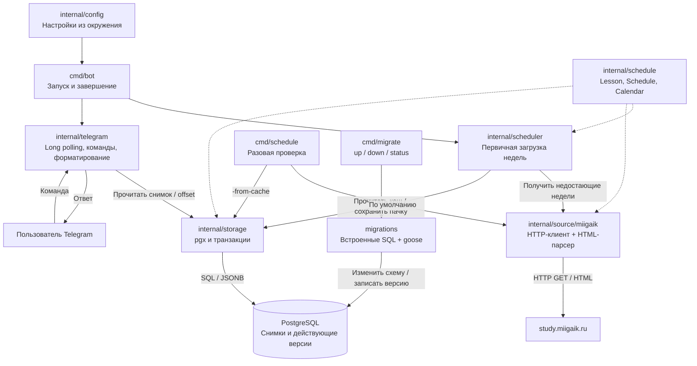

# Lunara

Telegram-бот расписания МИИГАиК на Go. Реализован **этап 4 из 7**:
календарь недель, клиент и HTML-парсер, PostgreSQL-хранилище, миграции и
первичная загрузка расписания и Telegram-команды. Периодический watcher ещё не подключён.

## Архитектура

Приложение состоит из одного Go-процесса и PostgreSQL. Пакеты разделены по задачам:
источник получает и разбирает расписание, scheduler координирует загрузку,
storage хранит нормализованные данные. `cmd/bot` собирает зависимости и управляет
жизненным циклом. Отдельные команды миграций и ручной проверки используют те же
пакеты; постоянно работающими сервисами они не являются.

### Реализовано после этапа 4

Схема показывает связи команд и пакетов. Стрелки с подписями обозначают обращения
к источнику и БД; пунктиром показано использование общих моделей и календаря.



При старте scheduler сначала читает текущую и следующие недели из PostgreSQL.
Если часть недель отсутствует, клиент получает их с сайта, а парсер возвращает
проверенные структуры `Schedule` и `Lesson`. Только после успешной загрузки всей
недостающей пачки storage сохраняет её одной транзакцией. Существующие снимки
остаются базовой версией. Далее процесс получает команды Telegram через long polling.

HTML не сравнивается и не хранится в БД. В репозитории есть сокращённые HTML-примеры
для воспроизводимых тестов парсера; при обычном запуске они не используются.

### План следующих этапов

Компоненты ниже ещё не реализованы. Они будут добавлены в тот же Go-процесс.
Сервис расписания будет выбирать день, неделю и следующую пару, а detector —
сравнивать нормализованные занятия и подтверждать изменения перед рассылкой.

```mermaid
flowchart LR
    Watcher["Scheduler / watcher"] --> Source["Клиент и парсер МИИГАиК"]
    Source -->|"Новый Schedule"| Detector["Change detector<br/>Сравнение и подтверждение"]
    Detector -->|"Прочитать базовую версию / сохранить изменения"| Storage
    Storage -->|"Подтверждённое задание"| Sender["Отправка уведомлений"]
    Sender -->|"Одна сводка изменений"| Chat["Заданный групповой чат"]
    classDef planned fill:#f5f5f5,stroke:#777,stroke-dasharray:5 5;
    class Watcher,Detector,Sender planned;
```



Watcher и обработка команд выполняют разные задачи: команды выдают расписание
по запросу, watcher проверяет источник и готовит сводку подтверждённых изменений.
Уведомления о начале пар и предполагаемых отменах в архитектуру не входят.

## Локальный запуск

Требуется Go 1.26 или новее и работающий PostgreSQL. Версии Go-зависимостей
закреплены в go.mod/go.sum. Приложение читает переменные окружения;
автоматически `.env` не загружает.

Укажите подключение через `DATABASE_URL` (URL или keyword DSN) либо стандартные
переменные PostgreSQL `PGHOST`, `PGPORT`, `PGUSER`, `PGPASSWORD`, `PGDATABASE`,
`PGSSLMODE`. Например, для локального PostgreSQL:

```sh
export PGHOST=localhost
export PGPORT=5432
export PGUSER=lunara
export PGDATABASE=lunara
export TELEGRAM_BOT_TOKEN='токен от BotFather'
# Необязательно: разрешённая группа или супергруппа; личные чаты доступны всегда.
export TELEGRAM_CHAT_ID='-1001234567890'
# Задайте PGPASSWORD для своей БД, если требуется пароль.
go run ./cmd/migrate up
go run ./cmd/bot
```

Приложение проверяет подключение к БД, загружает недостающие недели и запускает
Telegram long polling до SIGINT/SIGTERM. Логи пишутся в JSON. Строка подключения
и токен не логируются.
Миграции выполняются отдельной командой, не при запуске бота:

```sh
go run ./cmd/migrate status
go run ./cmd/migrate up
```

`down` откатывает последнюю миграцию; откат первой миграции удаляет снимки
расписания. SQL-файлы встроены в бинарный файл; goose хранит версию схемы и
блокирует одновременное применение миграций.

## Календарь и первичная загрузка

Настройки перечислены в `.env.example`. По умолчанию группа `1306`, зона
`Europe/Moscow`, верхняя опорная неделя с `2025-09-01`. Правило найдено в
публичном JavaScript https://study.miigaik.ru/static/schedule/js/schedule-page.js;
его следует сверять при изменении правил сайта. Тип опоры — `upper` или `lower`.
Недели начинаются в понедельник и не сбрасываются на границе года.
Часовые пояса встроены в бинарный файл; границы учебных периодов не требуются.

`BOOTSTRAP_WEEKS=2` — текущая и следующая календарные недели; допустимо от 1 до 12.
`STARTUP_TIMEOUT=2m` ограничивает подключение и первичную загрузку целиком.
`SHUTDOWN_TIMEOUT=20s` ограничивает завершение и закрытие пула БД.
При большом диапазоне загрузки может потребоваться увеличить тайм-аут старта.

Первичная загрузка читает кеш, получает с сайта только отсутствующие недели и
сохраняет всю недостающую пачку одной транзакцией. Сбой любого запроса оставляет
пачку несохранённой, ранее сохранённые данные доступны. При ошибке источника
процесс продолжает работу с кешем; ошибка чтения/записи БД завершает старт.
Первичная загрузка не отправляет уведомления.

Повторный запуск не перезаписывает существующие недели и не создаёт дубли.
Это относится и к сохранённым ответам `unpublished`: их повторная проверка,
подтверждение изменений и обновление действующих снимков будут подключены на
этапах 5–6. На текущем этапе автоматическое обновление после запуска отсутствует.

В PostgreSQL хранятся:

- `schedule_snapshots`: нормализованные занятия в JSONB, группа, начало недели,
  её тип, статус публикации, время проверки, хеш и версия нормализации.
- `schedule_heads`: указатель на действующий снимок для группы и недели.
- `bot_state`: следующий необработанный Telegram update ID.
- `goose_db_version`: журнал миграций.

Время проверки хранится в TIMESTAMPTZ и возвращается в UTC. Даты занятий остаются
локальными датами календаря. HTML в БД не сохраняется. Ключ недели — группа и
дата понедельника; отсутствие записи отличается от статуса `unpublished`.

## Проверка источника и кеша

Разовая загрузка недели с сайта в JSON:

```sh
go run ./cmd/schedule -date 2026-09-28
```

Чтение сохранённой недели без обращения к сайту:

```sh
go run ./cmd/schedule -from-cache -date 2026-09-28
```

Без `-date` выбирается текущая неделя. Группа задаётся через `GROUP_ID`.
Команда имеет общий тайм-аут одну минуту; ошибки идут в stderr.

Клиент запрашивает полную страницу по `groupId`, `dateStart`, `dateEnd`.
Тайм-аут попытки — не более 15 секунд, ответ — не более 2 МиБ.
До трёх попыток при временных сетевых ошибках, HTTP 429 и 5xx;
между запросами минимум секунда. `Retry-After` учитывается, ожидание прерывается
контекстом. Запросы одного клиента последовательны, редиректы запрещены.

Парсер проверяет группу, заголовок, диапазон дат, дни недели и все карточки.
При ошибке возвращается нулевой результат. Явный блок «Нет данных…» даёт статус
`unpublished`, а не удаление занятий. `CheckedAt` устанавливается только после
успешной загрузки. Поддерживаются полные HTML-документы, HTMX-фрагменты не принимаются.

Пробелы и NBSP нормализуются, известные типы занятий приводятся к общим значениям,
неизвестные сохраняются в `RawType`. Занятия и списки преподавателей/аудиторий
сортируются; повторяющиеся занятия сохраняются. SHA-256 считается по
нормализованным данным, включая группу, календарную неделю, статус и версию
нормализации, без времени загрузки. Сравнение изменений появится на этапе 5.
Подгруппа читается из абзаца `Подгруппа: …`; этот вариант покрыт синтетическим
тестом, в сохранённых страницах группы 1306 подгрупп нет.

## Проверки

```sh
go test -race ./...
go vet ./...
go build ./...
```

Без `LUNARA_TEST_DATABASE_URL` PostgreSQL-тесты пропускаются. Для полного прогона
на установленном локальном PostgreSQL:

```sh
bash scripts/test-integration.sh
```

Скрипт запускает временный кластер внутри игнорируемой `.local`, используя
`initdb` и `pg_ctl`, с приватным Unix-сокетом без TCP. После тестов останавливает
сервер и удаляет его данные. Docker, sudo и системный кластер не используются.
Если задан `LUNARA_TEST_DATABASE_URL`, скрипт использует это подключение;
каждый интеграционный тест создаёт отдельную схему и удаляет только её.
Роль тестовой БД должна иметь право создавать схемы.

Проверяются миграции up/down и повторный up, сохранение и чтение JSONB, отсутствие
дублей, конкурентная загрузка, rollback при SQL-ошибке второй недели, сохранение
базовой версии и отмена контекстом. Тесты источника используют локальные HTML
и httptest, не живой сайт.

### Папка `.local`

`.local` — игнорируемый каталог артефактов локальных проверок. Сейчас в нём
находятся собранные бинарные файлы `bot`, `schedule`, `migrate` и вспомогательная
программа `yaml-check`, которой проверялся Compose без запуска Docker.
Эти файлы не нужны для `go run`, не попадают в Git и исключены из Docker-контекста.

Во время интеграционных тестов скрипт создаёт здесь временный кластер PostgreSQL,
а после завершения останавливает его и удаляет данные. Это отдельная тестовая БД;
рабочая БД бота задаётся подключением, а в Compose хранится в volume `postgres_data`.

**После завершения локальных проверок `.local` можно удалить целиком.** Это не
удалит исходники или рабочую БД. При следующем запуске скрипт интеграционных тестов
создаст каталог заново; бинарные файлы при необходимости собираются повторно.

## Контейнеры и структура

Dockerfile содержит бинарные файлы bot и migrate. Compose сначала поднимает
PostgreSQL, затем выполняет задачу миграций и запускает приложение после её успеха.
Для Compose нужен `.env` из примера с непустым `POSTGRES_PASSWORD`.
Подключение контейнеров задаётся через PG* переменные, поэтому пароль не нужно
вставлять в URL; `DATABASE_URL` внутри контейнеров пустой. Порт БД наружу не опубликован.

Docker не запускался, контейнерная сборка не проверена. Образы закреплены по тегам.

- `cmd/bot`: запуск, первичная загрузка и завершение.
- `cmd/schedule`: разовая проверка источника или чтение кеша.
- `cmd/migrate`, `migrations`: команды и SQL-миграции.
- `internal/config`, `internal/schedule`: настройки, модели, календарь.
- `internal/source/miigaik`: клиент, парсер и HTML-примеры для тестов.
- `internal/storage`: PostgreSQL и транзакции.
- `internal/scheduler`: первичная загрузка.

Этап 4 завершён. Следующий этап 5: сравнение и подтверждение изменений;
этап 6: watcher и доставка; этап 7: экзамены
и опциональные рассылки. Каждый этап выполняется отдельно.
